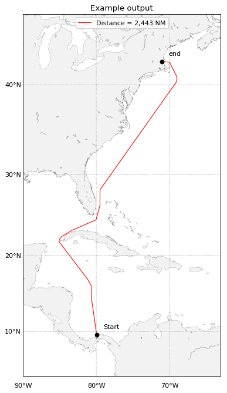

# Routemap

Generates a nice looking map of a route from various sources. Here is an 
example.

Requires libgeos and tkinter to be installed. On Debian:

    sudo apt-get install libgeos-dev python3-tk

If running headless on a server, then python3-tk is not needed.

Also requires Basemap to be installed manually.

    pip install git+https://github.com/matplotlib/basemap.git#egg=basemappip install git+https://github.com/matplotlib/basemap.git#egg=basemap